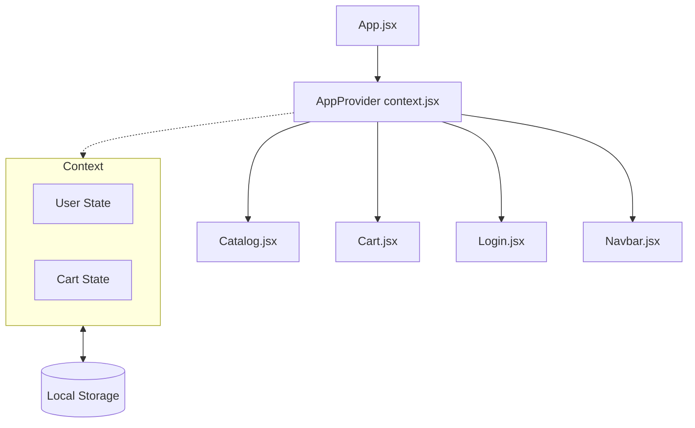

# Production Capstone Project: TechStore 🛒

A complete, production-ready E-Commerce Storefront web application built for the final capstone evaluation.

## 🌟 Feature Highlights

*   **Authentication Simulation:** Users can "log in" and their session is simulated and persisted.
*   **Interactive Catalog:** A dynamic product list populated with various tech items, complete with images and pricing.
*   **Dynamic CRUD Operations:**
    *   **Create:** Add items to the shopping cart.
    *   **Read:** View catalog and cart contents.
    *   **Update:** Modify quantities in the cart.
    *   **Delete:** Remove items from the cart.
*   **Persistent State:** Utilizes browser `localStorage` to keep the user's cart and session intact across page reloads.

## 🏛 Architecture

*   **Frontend Framework:** React (bootstrapped with Vite)
*   **Routing:** React Router v6
*   **State Management:** React Context API + LocalStorage (for persistence)
*   **Styling:** Tailwind CSS + Lucide Icons

### State Management Flow


## 🚀 Setup Instructions

1.  **Clone the repository:**
    ```bash
    git clone <your-repo-url>
    cd production-web-capstone
    ```

2.  **Install Dependencies:**
    ```bash
    npm install
    ```

3.  **Run Development Server:**
    ```bash
    npm run dev
    ```
    The app will be available at `http://localhost:5173`.

4.  **Build for Production:**
    ```bash
    npm run build
    ```

## ☁️ Deployment

This project is configured to be easily deployed to modern cloud platforms:

*   **Vercel / Netlify:** Connect your GitHub repository, set the build command to `npm run build`, and the publish directory to `dist`.
*   **GitHub Pages:** Utilize the `gh-pages` package or GitHub Actions to deploy the `dist` folder.

*(Note: In Vite projects, ensure `base` path in `vite.config.js` is set correctly if not deploying to the root domain.)*
